# Diligence Room

**A Fortified Enterprise Agentic Fleet for M&A due diligence — eight specialist
agents across Legal, Finance, HR, IP/Tech, Tax, Regulatory, ESG, and Real
Estate turn a hostile data room into a defensible deal decision. They discover
the risks no single reviewer can see, collaborate through governed handoffs,
and leave an evidence trail a deal team can trust.**

> Documents are adversaries, agents are principals, and memory is partitioned by policy, not convenience.



The four-layer stack of vision §22 rendered as Mermaid: ingestion, sentinel,
agents, coordination, and the dashboard, wrapped by the compliance plane and
OpenTelemetry traces. Mermaid source:
[`docs/diagram/architecture.mmd`](docs/diagram/architecture.mmd); PNG export:
[`docs/diagram/architecture.png`](docs/diagram/architecture.png).

Built for the **AllThingsAgentic Hackathon** (Fortified Enterprise Fleet track)
on the Google Gemini Enterprise Agent Platform: Python + Google ADK,
Agent Runtime / Vertex AI Agent Engine, Gemini 3.5 Flash, Firestore,
Pub/Sub, Cloud Run, Model Armor, Cloud Trace.

| | |
|---|---|
| Hosted dashboard | https://diligence-room-dashboard-378831539922.asia-south1.run.app |
| Hosted gateway | https://gateway-378831539922.asia-south1.run.app |
| Agent Runtime / Vertex AI Agent Engine (deployed agent) | `projects/378831539922/locations/us-central1/reasoningEngines/7141202128323739648` |
| Live trace example | [Cloud Trace `d77658309933cf2ff4a5d336e9960a64`](https://console.cloud.google.com/traces/list?project=diligence-room-live&tid=d77658309933cf2ff4a5d336e9960a64) |
| GCP project | `diligence-room-live` (378831539922); serving asia-south1 + us-central1, Firestore asia-south1 (serving) + nam5, data room US+EU |

- Specification: [`diligence-room-vision.md`](diligence-room-vision.md)
- Day-by-day build plan: [`BUILD_PLAN.md`](BUILD_PLAN.md)
- Deployment receipts (every live ID below): [`docs/evidence/live-deployment.txt`](docs/evidence/live-deployment.txt)

## The fortified fleet behind the deal room

Project Falcon is built around the enterprise controls that make a multi-agent
system credible in a live transaction: discovery, durable state, governed
delegation, and auditability. Each is implemented in the running fleet and has
both source and live proof.

| Track focus area | Our implementation | Where | Live evidence |
|---|---|---|---|
| **Discovery & Lifecycle — Agent Registry** | Published into the **platform Agent Registry** as A2A agent cards, with our Firestore store as the versioning, approval and rollback layer on top | [`infra/agent_registry.py`](infra/agent_registry.py), [`registry/`](registry/) | All 8 projected as discoverable Agents by `gcloud agent-registry agents list`; each card resolves at `GET /agents/{id}`; Legal v2.5 published, harness RED, rolled back to 2.4.0 with finding counts identical |
| **Core Execution — Agent Runtime** | Async execution on Agent Runtime / Vertex AI Agent Engine + retry/idempotency + DLQ | [`runtime/`](runtime/), [`infra/deploy/agent_engine.py`](infra/deploy/agent_engine.py) | Deployed engine returned a verified asynchronous response |
| **Long-term State — Memory Bank** | **Agent Platform Memory Bank** holds durable entity memory across sessions; Firestore keeps the append-only event log, findings and crash-resume checkpoints | [`memory/memory_bank.py`](memory/memory_bank.py), [`memory/`](memory/), [`runtime/checkpoint.py`](runtime/checkpoint.py) | 6 entity memories for `deal-falcon`; `recall("Meridian")` returns the 18.3% and change-of-control facts from a process that never imports Firestore; kill-mid-run → resume → zero duplicate findings |
| **Agent Identity — zero-trust access** | Per-agent principals, manifest→identity binding, agent→data + human→output AuthZ | [`identity/`](identity/) | `Legal ⊬ Finance`, `Finance ⊬ HR`, cross-deal reads: typed `AuthzDenied` + audit events |
| **Agent Gateway — routing + policy** | Deny-default policy engine with machine-readable reason enums + rate limits (built, not bought) | [`gateway/`](gateway/) | Live verdicts: `allow/aggregate_permitted` (legal→finance) and `deny/no_policy` — transcript below |
| **Model Armor — guardrails** | Managed template + project rules + quarantine store; fail-closed on unparseable verdicts | [`armor/`](armor/) | `direct_a.pdf` → `MATCH_FOUND pi_and_jailbreak` → quarantined before agent context |
| **Telemetry — Agent Observability** | OTel GenAI semantic-convention spans → Cloud Trace; finding ↔ trace durable link | [`observability/`](observability/) | CRITICAL finding `b093295dab91` carries `audit_trace_id` that resolves in Cloud Trace |
| **Compliance & data sovereignty** | CMEK keyrings, DLP inspect template, region pinning, retention, zero SA keys, audit logs | [`compliance/`](compliance/), [`infra/compliance_config/`](infra/compliance_config/) | KMS `deal-falcon-primary` US+EU; DLP `deal-falcon-hr-inspect`; audit configs applied |

## Overview: Project Falcon

The demonstration deal is **Project Falcon** (`deal-falcon`): an eight-workstream
agent fleet runs M&A due diligence on **Vantage Robotics, Inc.**, a synthetic
target whose data room is seeded with a genuine finding surface. Against the
golden corpus the fleet must surface four keystone findings:

- **Legal**: the Meridian Logistics change-of-control termination right at `clause:11.3`
- **Finance**: an 18.3% FY27 revenue concentration on Meridian Logistics
- **HR**: the pending departure of Dana Whitfield, the Meridian account owner
- **IP/Tech**: the TitanBridge 4.1 dependency at vendor end-of-life

**The problem:** M&A diligence is an expensive relay race. Legal finds a
change-of-control clause. Finance finds customer concentration. HR finds the
relationship owner is leaving. Technology finds a critical dependency is at
end-of-life. These signals live in different documents, reach different
reviewers, and too often meet only after the deal team has lost time—or
leverage. Meanwhile, the data room itself is an unauthenticated document feed:
hostile uploads, prompt injection, exfiltration attempts, and honest noise all
arrive through the same door.

**The twist:** *documents are adversaries.* Zero trust is enforced
structurally, not aspirationally: every upload passes format detection,
parsing, a cheap Gemma sentinel tripwire, and Model Armor screening before
anything may reach agent context. Agents are principals with isolated
identities, versioned manifests in the Agent Registry, and memory partitioned
into org / deal / workstream. Every read and write crosses the deny-default
Agent Gateway policy engine, and the whole deal workspace sits inside a
compliance plane (CMEK, VPC-SC config, DLP, region pinning, retention) with
Cloud Trace capturing OpenTelemetry GenAI spans.

**The moment that matters:** Project Falcon connects those signals into one
decision: a compound customer-exit exposure that threatens deal economics.
The fleet does the exhaustive, cross-functional work; the deal-room analyst
keeps the decision and the final negotiation approval. For the auditor, every
decision carries a machine-readable reason, every finding points to a
verbatim source span, and every handoff is preserved as an audit event.

The full fourteen days replay offline in minutes. The deterministic scenario
[`data/scenarios/project_falcon.json`](data/scenarios/project_falcon.json)
(49 events, seed 42) drives [`runtime/replay.py`](runtime/replay.py) into the
**real** pipeline under the Firestore emulator: uploads, keystone findings, the
20-attack red-team ledger, the 2030 amendment, the Legal v2.5 upgrade and
rollback, and the negotiation beat ending at the human-approval gate. No live
LLM, no live GCP.

## Why this task warrants a multi-agent system (Innovation & Operational Utility)

A single agent cannot do this task, and the system proves it structurally:

| Workstream agent | Reads only | Writes only | Gated tool path |
|---|---|---|---|
| Legal | `contracts` | Legal partition | CoC finding → `ask_agent(finance)` over the gateway |
| Finance | `financials` | Finance partition | Returns scalar aggregates only — raw models never cross |
| HR | `rosters` | HR partition | Key-person finding |
| IP/Tech | `tech-inventory` | IP/Tech partition | EOL-dependency finding |
| Tax · Regulatory · ESG · Real Estate | their categories | their partitions | scaffold parity, registered + seeded |
| **Coordinator** | findings graph | anchor partition | CRITICAL synthesis — refuses unless **all four** contributors converge |

Delegation is intelligent, not decorative: the Legal agent discovers the
change-of-control clause, then *asks Finance* (through the gateway, for a
permitted purpose, receiving only the aggregate `18.3%`); the Coordinator
synthesizes **one CRITICAL finding only when every required workstream
independently flags the same entity** — remove any one contributor and the
synthesis refuses (removal-proof, tested in
[`tests/test_coordinator.py`](tests/)). High-value autonomous execution runs
unattended; the human appears exactly once, at the negotiation approval gate.

Live proof: CRITICAL finding `b093295dab91` links contributors
`e29cdbba7dbe` (Legal), `3329fa79c105` (Finance), `767a4ecaa95f` (HR),
`744c4fa6253e` (IP/Tech) and fired `finding.escalated` into the deal-lead
inbox.

## Architectural Discipline & Tech Stack

Decoupling, state, and failure tolerance are the submission, not a side effect:

| Failure mode | Mechanism | Proof |
|---|---|---|
| Agent loops or runs away | Loop guard: max iterations + tool-call budget + wall-clock; checkpoint + terminate + `run_bounds_exceeded` event | [`runtime/guards.py`](runtime/guards.py), [`tests/test_guards.py`](tests/) runaway fixture |
| Fabricated citations | Evidence gate: every `verbatim_span` must resolve against the parsed source chunk at write time; unresolvable → reject + event | [`memory/findings.py`](memory/findings.py), [`tests/test_evidence_gate.py`](tests/) |
| Worker crash mid-run | Append-only event log + checkpoints; restart completes with zero duplicate findings (idempotency asserted) | [`runtime/checkpoint.py`](runtime/checkpoint.py), [`tests/test_crash_resume.py`](tests/) |
| Poisoned/malformed events | Retry/backoff with idempotency keys → dead-letter queue + redrive | [`runtime/dlq.py`](runtime/dlq.py), failure drill evidence |
| Cross-workstream leakage | Partition keys + AuthZ in the dispatcher; denials emit audit events | [`tests/test_isolation.py`](tests/): Legal ⊬ Finance, Finance ⊬ HR, cross-deal |
| Bad agent version in production | Registry rollback via `rollback_target`; memory survives version swap | [`docs/evidence/d12-registry-rollback.txt`](docs/evidence/d12-registry-rollback.txt) |
| Gateway rule bypass | Deny-default seed; aggregate-only response filter blocks extraction attempts | [`tests/test_gateway_aggregate.py`](tests/) |
| Model Armor fail-open | Live-discovered mapping bug fixed to fail **closed** on any unrecognizable verdict | [`armor/model_armor.py`](armor/model_armor.py), [`docs/evidence/d7-live-armor.txt`](docs/evidence/d7-live-armor.txt) |

Tools are scoped per principal (`data-room-read` category-scoped,
`finding-create` partition-scoped, `gateway-query` policy-scoped); state lives
in Firestore with transactional sequence numbers; the gateway is a separate
service from the fleet; ingestion, sentinel, armor, coordination and dashboard
are independently testable modules — 1,103 tests, mypy strict across 209
files.

## Annotated live session — the tool-call sequence

Captured live on 2026-08-27 against project `diligence-room` (full receipts:
[`docs/evidence/live-deployment.txt`](docs/evidence/live-deployment.txt)). This
is the sequence a text-only evaluator can verify end-to-end:

```text
1. UPLOAD → EVENT BUS
   gcloud storage cp contract_meridian_logistics.pdf gs://diligence-room-dataroom-deal-falcon-us/
   → OBJECT_FINALIZE → topic deal-events → subscription deal-events-sub
   consumer --confirm-live --once  →  processed=1 duplicates=1
   (a re-upload of the same object dedupes via the audit log — idempotent)

2. INGESTION — DOCUMENTS ARE ADVERSARIES
   detect → parse → sentinel tripwire → Flash classify → route
   injection_probe.docx  → tripwired (never reaches agent context)
   scanned_invoice.pdf   → honest needs_ocr (never fabricated text)

3. FLEET — FOUR AGENTS, EACH INSIDE ITS PARTITION (real Gemini 3.5 Flash loops)
   legal:    data_room_read('contracts','contract_meridian_logistics.pdf')
             → ask_agent(finance, purpose=revenue_concentration)
             → Gateway verdict: allow / aggregate_permitted / rule legal->finance
             → finance returns the scalar 18.3%
             → finding_create → e29cdbba7dbe  (evidence gate: span resolves clause:11.3)
   finance:  → 3329fa79c105   hr: → 767a4ecaa95f   ip_tech: → 744c4fa6253e

4. DENY BEAT
   hr-agent → finance direct read  →  DENY no_policy  + audit event

5. COORDINATION KEYSTONE — NO SINGLE AGENT CAN PRODUCE THIS
   coordinator: convergence entity 'Meridian Logistics, Inc.' in all 4 workstreams
   → CRITICAL b093295dab91 "Compound customer-exit exposure threatens deal economics"
   → finding.escalated → deal-lead inbox

6. RED TEAM — 20 ATTACKS, 4 CLASSES, 20/20 BLOCKED
   (injection 8 · exfiltration 5 · cross-workstream 4 · poisoning/cross-deal 3)
   direct_a.pdf → Model Armor MATCH_FOUND pi_and_jailbreak
   → quarantined (deals/deal-falcon/quarantined/direct_a.pdf) + security event

7. HUMAN APPROVAL GATE
   negotiation: draft → pending_approval → approved → send_logged
```

Real gateway transcript against the deployed Cloud Run service:

```bash
$ curl -s -X POST https://gateway-378831539922.asia-south1.run.app/gateway/decide \
    -H 'Content-Type: application/json' \
    -d '{"sender_identity":"legal-agent@deal-falcon","target_workstream":"finance",
         "deal_id":"deal-falcon","question":"What share of FY27 revenue comes from Meridian Logistics?",
         "purpose":"revenue_concentration"}'
{"decision":"allow","reason":"aggregate_permitted","rule_id":"legal->finance"}

$ # same endpoint, unauthorized corridor:
{"decision":"deny","reason":"no_policy","rule_id":null}
```

## Demo & Production Readiness

| Artifact | Where |
|---|---|
| **Hosted dashboard** (Overview · Findings+Trace · Documents · Security · Registry, live Firestore tallies) | https://diligence-room-dashboard-378831539922.asia-south1.run.app |
| **Hosted gateway** (policy edge, `/gateway/decide`) | https://gateway-378831539922.asia-south1.run.app |
| **Agent Runtime / Vertex AI Agent Engine** (deployed ADK agent, async invoke verified) | `projects/378831539922/locations/us-central1/reasoningEngines/7141202128323739648` |
| **Cloud Trace** (GenAI spans; finding `audit_trace_id` resolves) | [console link above](https://console.cloud.google.com/traces/list?project=diligence-room-live&tid=d77658309933cf2ff4a5d336e9960a64) |
| **Architecture diagram** | [`docs/diagram/architecture.svg`](docs/diagram/architecture.svg) |
| **Demonstration video** (≤4 min; backend on Google Cloud: Cloud Run URLs, Agent Runtime / Vertex AI Agent Engine, Cloud Console) | link added on the submission form |
| **Deployment receipts** (gcloud outputs, IDs, timestamps) | [`docs/evidence/live-deployment.txt`](docs/evidence/live-deployment.txt) |

Serving runs in `asia-south1`, with a second Cloud Run region in
`us-central1`. Firestore sits in `asia-south1` alongside the services: the
round trip from the operator's location was 834 ms against the original region
and 156 ms here, which took a full replay from 262 s to 57 s.

## Checkable numbers

| Metric | Value | Verify |
|---|---|---|
| Registered workstream agents | 8 (+ coordinator + negotiation) | `registry/seed.py` → live Firestore |
| Keystone findings → CRITICAL synthesis | 4 → 1 (`b093295dab91`, 4 contributor links) | live Firestore `deal-falcon` |
| Red-team ledger | 20 attacks / 4 classes; **20/20 blocked**; 0 false positives on the 20-doc clean corpus | [`redteam/expected.yaml`](redteam/expected.yaml) |
| Deterministic replay | 49 events, seed 42, **< 4 min**, identical across consecutive runs | [`runtime/replay.py`](runtime/replay.py) |
| Test battery | **1,103 passed**; mypy strict 209 files; gitleaks clean | `uv run pytest` |
| Evidence gate | every quoted span resolves verbatim at write time | `memory/findings.py` |
| Secrets posture | **0 service-account keys** (ADC + workload identity only) | `infra/guardrails.py` |
| Budget guardrails | $170 hard cap; alerts at 50% / 80% / 100% | `infra/bootstrap_gcp.py` |
| Live deal events audited | 143 (fleet, gateway, security, negotiation) | `deals/deal-falcon/events` |

## Quickstart

```bash
# 1. Install dependencies (Python 3.11, uv)
uv sync

# 2. Bootstrap the GCP project (project verify, billing link, APIs,
#    staging bucket, budget alerts at $85/$136/$170)
uv run python infra/bootstrap_gcp.py

# 3. Run the offline test battery (session-scoped Firestore emulator)
uv run pytest

# 4. Build the executive dashboard (FastAPI backend + React frontend)
npm --prefix dashboard/web install
npm --prefix dashboard/web run build
```

Optional steps beyond bootstrap:

```bash
# Apply org-safety guardrails (audit logs, SA-key policy)
uv run python infra/guardrails.py

# Deploy the ADK agent to Agent Runtime / Vertex AI Agent Engine and invoke it
uv run python infra/deploy/agent_engine.py deploy
uv run python infra/deploy/agent_engine.py invoke
```

The full live provisioning runbook (Firestore, data room, registry, Cloud Run
deploys, verification curls) is in
[`docs/deal_provisioning.md`](docs/deal_provisioning.md); every deploy script
is write-gated behind `--confirm-live`.

## Stack

| Component | Role |
|---|---|
| Google ADK | Shared agent scaffolding: eight workstreams + coordinator + negotiation |
| Agent Runtime / Vertex AI Agent Engine | Hosted ADK deployment + asynchronous invocation |
| Gemini 3.5 Flash | Workstream reasoning + classification behind the sentinel cost gate |
| Gemma sentinel | Cheap pre-classification, PII marking, and tripwire before any premium call |
| FastAPI | Agent Gateway policy engine + dashboard API edge |
| Firestore | Partitioned memory (org / deal / workstream), event log, findings |
| Pub/Sub | Event bus (`document.*`, `finding.*`, `security.*`) |
| Cloud Run | Gateway and dashboard edge serving |
| Model Armor | Managed screening + project rules + quarantine store |
| Document AI + Cloud DLP | OCR and clause-locator parsing; PII scans feeding the sentinel |
| Cloud Trace | OpenTelemetry GenAI semantic-convention spans across the pipeline |
| Cloud KMS (CMEK) | Customer-managed encryption keys for the compliance plane |

## Evaluation

The evaluation proof lives in [`evals/`](evals/), with the red-team
suite in [`redteam/`](redteam/):

- **Golden set** ([`evals/golden_set.py`](evals/golden_set.py)): 20 pinned
  docs, the committed clean corpus. Four keystone documents pin byte-exact
  finding titles, severities, affected entities, and chunk locators; the other
  sixteen are noise and scaffold that a correct fleet must not over-report on.
- **Shadow harness** ([`evals/harness.py`](evals/harness.py)): runs the four
  deep workstreams through the same evidence-gated `finding_create` path the
  live fleet uses, then diffs produced findings against the golden set in
  strict exact match on title + severity + affected entities. A `missing` or
  `downgraded` pin fails the run; unpinned `new` titles are reported but do
  not gate. Deterministic by construction: fixed stamp, sorted diff, no
  network, no live LLM.
- **Regression candidate** ([`evals/legal_v25.py`](evals/legal_v25.py)): the
  deliberately broken Legal v2.5 that the upgrade/rollback rehearsal runs
  through the harness.
- **Red-team ledger** ([`redteam/expected.yaml`](redteam/expected.yaml)): 20
  attack fixtures across four batches. Every fixture must be quarantined by
  the sentinel tripwire or Model Armor project rules before reaching agent
  context, scored per vision §13 (20/20 at Checkpoint 2).

```bash
uv run pytest tests/test_golden_set.py tests/test_harness.py tests/test_redteam_runner.py
```

## Findings & learnings

What building, breaking, and validating the fleet taught us:

1. **Managed guardrails can fail open.** Our first live Model Armor call
   exposed a response-mapping bug that turned `MATCH_FOUND` into
   `blocked=False`. We rewrote the client to fail **closed** on any
   unrecognizable verdict and added tests for both fail-closed paths —
   discovered live, inside the window, with receipts
   ([`docs/evidence/d7-live-armor.txt`](docs/evidence/d7-live-armor.txt)).
2. **LLM entity naming is a coordination hazard.** One agent wrote
   "Meridian Logistics, Inc. account"; strict convergence then refused the
   CRITICAL synthesis. The fix was not fuzzy matching (that would weaken the
   keystone) but a canonical entity-naming contract in the `finding_create`
   tool specification.
3. **Deleted GCP projects leave zombies.** Project undelete restores metadata,
   not Firestore data; the `(default)` database became unservable with no
   delete/recreate path. We shipped an env-driven client factory
   ([`memory/db.py`](memory/db.py)) routing live traffic to a named database —
   15 call sites, zero test-path changes.
4. **Cost gates work.** A cheap Gemma sentinel tripwire in front of premium
   Flash calls keeps the project inside a $170 budget with alerts at
   50/80/100%.
5. **Deployment packaging drifts silently.** The Agent Runtime remote
   requirements lagged the agent's module-level imports until a live container
   failed to start; the fix now ships the full first-party import closure.

## Data sources

All deal data is **synthetic**, authored deterministically for this project:
the Vantage Robotics corpus ([`data/vantage_robotics/`](data/vantage_robotics/),
generated by [`scripts/author_dataset.py`](scripts/author_dataset.py)), the
20-document golden set, the 20-attack red-team fixtures
([`redteam/attacks/`](redteam/attacks/)), and the 49-event Project Falcon
scenario. No real company data, no real PII; the DLP template and HR fixtures
use invented records.

## Bonus contributions (Stage Three)

| Bonus | Status | Where |
|---|---|---|
| Blog post, public, created for the AllThingsAgentic Hackathon (+0.2) | Draft ready — publish and replace the placeholder URL before claiming the bonus | [`docs/blog/draft.md`](docs/blog/draft.md) |
| Social post with `#AllThingsAgenticHackathon` (+0.2) | Pending publication | add the public URL on the submission form |
| Additional Google AI model: **Gemma 4** ingestion sentinel (+0.2) | Live and verified — `gemma-4-26b-a4b-it` classifies a real termination clause as `contract` at 0.98 and tripwires a direct injection | [`ingestion/sentinel.py`](ingestion/sentinel.py), verification in [`docs/evidence/gemma-live.txt`](docs/evidence/gemma-live.txt) |

## Repository layout

```
diligence-room/
├── infra/          GCP bootstrap, deployment scripts, compliance config
├── registry/       Agent Registry (manifests, versions, approval, rollback)
├── runtime/        Deal runtime (events, guards, checkpoints, replay, DLQ)
├── agents/         ADK agent fleet (8 workstreams + coordinator + negotiation)
├── memory/         Partitioned memory (org/deal/workstream), event log, findings
├── identity/       Zero-trust agent principals + agent→data / human→output AuthZ
├── gateway/        Agent Gateway policy engine (the build-not-buy)
├── ingestion/      Format detection → parsing → Gemma sentinel → classification
├── armor/          Model Armor client, project rules, quarantine store
├── compliance/     Region pinning, DLP config
├── observability/  OTel GenAI semantic conventions → Cloud Trace
├── coordination/   Red-flag scoring, escalation
├── redteam/        20-attack red-team suite + scorecard
├── dashboard/      FastAPI backend + React frontend (6 views)
├── data/           Synthetic Vantage Robotics dataset + replay scenarios
├── evals/          Golden set + shadow evaluation harness
└── tests/          Isolation, evidence-gate, guards, and unit tests
```

## License

Apache-2.0 — see [`LICENSE`](LICENSE).
