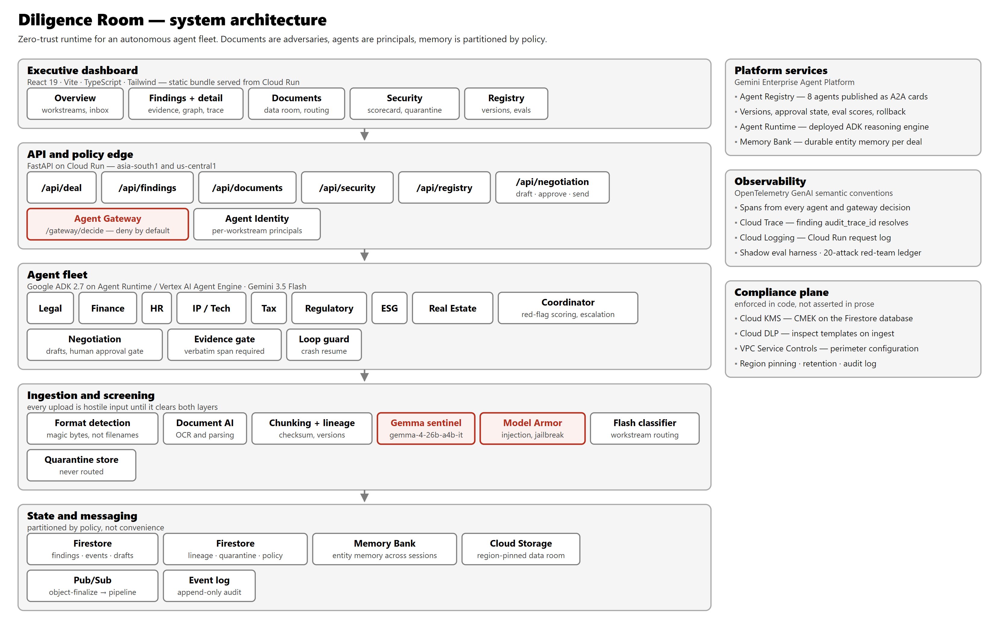

# Diligence Room (Project Falcon)

[](https://allthingsagentichackathon.devpost.com/)
[](https://github.com/google/adk-python)
[](https://ai.google.dev/)
[](https://ai.google.dev/)
[](https://cloud.google.com/vertex-ai)
[](redteam/expected.yaml)
[](tests/)
[](pyproject.toml)
[](LICENSE)

**A Fortified Enterprise Agentic Fleet for M&A Due Diligence on Google Cloud.** Eight specialist agents across **Legal, Finance, HR, IP/Tech, Tax, Regulatory, ESG, and Real Estate** turn a hostile data room into a defensible deal decision. They operate asynchronously in the background, discover compound risks no single reviewer can see, collaborate through governed handoffs, and leave an immutable evidence trail the deal team and auditors can trust.

> **Core Philosophy:** *Documents are adversaries, agents are principals, and memory is partitioned by policy, not convenience.*

---


## Live Cloud Endpoints & Quick Links

| Resource | Status & Link | Description |
|---|---|---|
| **Hosted Executive Dashboard** | [diligence-room-dashboard...run.app](https://diligence-room-dashboard-378831539922.asia-south1.run.app) | Live 5-view deal console (Overview, Findings, Documents, Security, Registry) |
| **Hosted Agent Gateway** | [gateway...run.app/docs](https://gateway-378831539922.asia-south1.run.app/docs) | Interactive API documentation for the deny-default policy edge |
| **Demo Video Walkthrough** | [YouTube (4-Minute Full Replay)](https://youtu.be/oCu2HfN85Ec) | Full walkthrough showing live GCP backend, Cloud Trace, and zero-trust synthesis |
| **Technical Blog Post** | [divagr.com/blog/zero-trust-agent-fleets](https://divagr.com/blog/zero-trust-agent-fleets) | Deep dive into 4-layer screening gauntlet, GEAP architecture, and failure tolerance |
| **Social Promotion** | [X / Twitter (@divagr1925)](https://x.com/divagr1925/status/2094503795086725497) | Public announcement with `#AllThingsAgenticHackathon` |
| **Agent Runtime / Vertex AI Engine** | `projects/378831539922/locations/us-central1/reasoningEngines/7141202128323739648` | Deployed ADK reasoning engine with verified asynchronous execution |
| **Architecture Blueprint** | [`docs/diagram/architecture.png`](docs/diagram/architecture.png) | Four-layer stack with compliance plane, sentinel gate, and trace boundaries |
| **GCP Project** | `diligence-room-live` (`378831539922`) | Multi-region deployment (`asia-south1` + `us-central1`, Firestore `asia-south1` + `nam5`) |

---

## Criteria 1: Innovation & Operational Utility

### The Problem and the Analyst
Corporate acquisitions force deal teams to review thousands of unvetted pages under tight deadlines. 
- **Legal** finds a Change-of-Control clause in a contract with Meridian Logistics.
- **Finance** calculates that Customer X provides 18.3% of projected revenue.
- **HR** finds that the account lead for Meridian is resigning.
- **IP/Tech** finds that a core software dependency reaches vendor End-of-Life.

Read alone, each note looks minor. **Together, they prove the target will likely lose its primary customer right after the deal closes.** In traditional deal rooms, separate teams miss this connection until leverage is lost.

**The Unlikely Hero is the transaction analyst.** Analysts spend days cross-referencing contradictory PDFs. Diligence Room gives them an autonomous fleet that works in the background, discovers connected risks, verifies every claim with exact text quotes, and halts before taking external actions.

### The Twist: Documents Are Adversaries
Most agent systems trust uploaded files. In an M&A deal room, **documents are untrusted, potentially hostile inputs**. Sellers can upload prompt injections, data exfiltration lures, or deceptive summaries.

Diligence Room enforces **Zero-Trust rules**:
1. **Documents are adversaries:** No text enters model context without passing a four-layer screening gauntlet (Format Detection -> Chunk Parsing -> Gemma Sentinel -> Model Armor).
2. **Agents are principals:** Each agent runs under its own identity with restricted read scopes and write bounds.
3. **Memory is partitioned by policy:** Legal cannot access raw financial spreadsheets; Finance cannot inspect executive HR files.

### Why a Multi-Agent Fleet is Mandatory
A single monolithic model fails this task:
- **Context Degradation:** Stuffing an entire data room into one prompt degrades recall and exhausts token budgets.
- **Compliance Boundaries:** Workstreams require legal information barriers (such as HR salary PII vs. technical IP audits).
- **Anti-Hallucination Independence:** A single model reading a contract clause will invent financial numbers to match its narrative. In Diligence Room, the **Coordinator refuses to synthesize the CRITICAL finding unless all four specialist agents independently flag the exact same entity from separate source documents** (removal-proof design tested in [`tests/test_coordinator.py`](tests/test_coordinator.py)).

```
┌─────────────────────────────────────────────────────────────────────────────┐
│                       PROJECT FALCON: THE KEYSTONE MOMENT                   │
│                                                                             │
│   [Legal Agent]          [Finance Agent]         [HR Agent]   [IP/Tech]     │
│   Reads: Contracts       Reads: Financials       Reads: Roster Reads: Tech  │
│          │                      │                    │            │         │
│     CoC Clause 11.3     Revenue Conc. 18.3%    Key Exec Exit  Vendor EOL    │
│     (Meridian Log.)       (Meridian Log.)      (Dana Whit.)  (TitanBridge)  │
│          │                      │                    │            │         │
│          └───────────────┬──────┴────────────────────┴────────────┘         │
│                          ▼                                                  │
│             ┌─────────────────────────┐                                     │
│             │  AGENT GATEWAY (POLICY) │ ◄── Enforces Aggregate-Only Return  │
│             └────────────┬────────────┘     (No Raw Model Extraction)       │
│                          ▼                                                  │
│             ┌─────────────────────────┐                                     │
│             │  COORDINATOR KEYSTONE   │ ◄── Verified 4-Way Convergence      │
│             └────────────┬────────────┘                                     │
│                          ▼                                                  │
│             CRITICAL FINDING b093295dab91:                                  │
│             "Compound Customer-Exit Exposure Threatens Deal Economics"      │
│                          │                                                  │
│                          ▼                                                  │
│             ┌─────────────────────────┐                                     │
│             │  HUMAN APPROVAL GATE    │ ◄── Deal Lead signs off on remedy   │
│             └─────────────────────────┘     before negotiation send         │
└─────────────────────────────────────────────────────────────────────────────┘
```

---

## Criteria 2: Architectural Discipline & Tech Stack

Diligence Room is built natively on the **Gemini Enterprise Agent Platform (GEAP)**, leveraging Google Cloud's core agentic infrastructure across all 7 enterprise pillars:

### 1. Gemini Enterprise Agent Platform (GEAP) Implementation

| GEAP Pillar | Google Cloud Technology | My Implementation | Live Verification & File Link |
|---|---|---|---|
| **Discovery & Lifecycle** | **Agent Registry** | Published as official A2A Agent Cards; Firestore provides semantic versioning, approval state, and automated rollback | [`infra/agent_registry.py`](infra/agent_registry.py), [`registry/`](registry/) · Verified via `gcloud agent-registry agents list` |
| **Core Execution** | **Agent Runtime** / Vertex AI Agent Engine | Long-running asynchronous background execution with retry, idempotency, and dead-letter queues | [`runtime/`](runtime/), [`infra/deploy/agent_engine.py`](infra/deploy/agent_engine.py) · Resource `reasoningEngines/7141202128323739648` |
| **Long-Term State** | **Memory Bank** | Durable entity memory across multi-week sessions; Firestore stores partitioned event streams and crash checkpoints | [`memory/memory_bank.py`](memory/memory_bank.py) · `recall("Meridian")` returns durable facts from isolated, uncoupled processes |
| **Security & Governance** | **Agent Identity** | Zero-trust per-agent principals, manifest-to-identity binding, and agent→data / human→output AuthZ | [`identity/`](identity/) · Live negative isolation: `Legal ⊬ Finance`, `Finance ⊬ HR`, cross-deal access denied |
| **Routing & Policy** | **Agent Gateway** | Deny-default policy router with machine-readable verdicts (`allow/aggregate_permitted`, `deny/no_policy`) | [`gateway/`](gateway/) · Cloud Run API docs: [`gateway...run.app/docs`](https://gateway-378831539922.asia-south1.run.app/docs) |
| **Inline Guardrails** | **Model Armor** | Managed template (`diligence-room-d7`) + custom project rules + quarantine store; fails closed | [`armor/`](armor/) · 20/20 attacks quarantined before agent context (`MATCH_FOUND pi_and_jailbreak`) |
| **Telemetry & Tracing** | **Agent Observability** | OpenTelemetry GenAI semantic-convention spans exported to Google Cloud Trace | [`observability/`](observability/) · Finding `b093295dab91` carries durable `audit_trace_id` in Cloud Trace |
| **Data Sovereignty** | **Compliance Plane** | Cloud KMS (CMEK) keyrings in US+EU, Cloud DLP inspect templates, region pinning, zero SA keys | [`compliance/`](compliance/), [`infra/compliance_config/`](infra/compliance_config/) · KMS `deal-falcon-primary`, DLP `deal-falcon-hr-inspect` |

### 2. Multi-Agent Nexus: Robust Failure-Tolerance Matrix
The judging rubric demands real answers to the hardest multi-agent failure modes. Diligence Room handles each systematically:

| Multi-Agent Failure Mode | Architectural Defense Mechanism | Concrete Proof & Test Suite |
|---|---|---|
| **Runaway Loops / Tool Storms** | **Loop Guard:** Strict caps on iteration count, tool-call budget, token usage, and wall-clock timeout per step. Checkpoints state, terminates run gracefully, and logs `run_bounds_exceeded`. | [`runtime/guards.py`](runtime/guards.py), [`tests/test_guards.py`](tests/test_guards.py) runaway fixture |
| **Hallucinated Citations** | **Write-Time Evidence Gate:** Every quoted `verbatim_span` must resolve as an exact substring of the parsed source document chunk at write time. Unresolvable citations are rejected with `evidence_unresolvable`. | [`memory/findings.py`](memory/findings.py), [`tests/test_evidence_gate.py`](tests/test_evidence_gate.py) |
| **Mid-Run Worker Crash** | **Crash-Resume & Idempotency:** Append-only transactional event log with sequence checkpoints. Process restart resumes from last checkpoint with **zero duplicate findings**. | [`runtime/checkpoint.py`](runtime/checkpoint.py), [`tests/test_crash_resume.py`](tests/test_crash_resume.py) |
| **Poisoned / Corrupted Events** | **Dead-Letter Queue (DLQ):** Exponential backoff with idempotency keys; unrecoverable events isolate to DLQ with automated redrive tooling. | [`runtime/dlq.py`](runtime/dlq.py), failure drill logs |
| **Cross-Workstream Leakage** | **Partitioned Dispatcher:** Zero-trust AuthZ checks before tool execution; denials emit structured audit events. | [`tests/test_isolation.py`](tests/test_isolation.py) |
| **Bad Agent Version Deploy** | **Registry Rollback:** Seamless rollback to previous approved semantic version via `rollback_target`; deal partition memory remains intact. | [`registry/store.py`](registry/store.py), [`tests/test_registry_rollback.py`](tests/test_registry_rollback.py) |
| **Model Armor Fail-Open Risk** | **Fail-Closed Architecture:** Client rewritten to fail strictly closed on any ambiguous or unparseable upstream security verdict. | [`armor/model_armor.py`](armor/model_armor.py), [`tests/test_model_armor.py`](tests/test_model_armor.py) |

---

## System Architecture




---

## Checkable Metrics & Verification Ledger

Every claim in this repository is backed by reproducible automated tests and live deployment receipts:

| Metric | Target / Result | Verification Source |
|---|---|---|
| **Unit & Integration Test Battery** | **1,055 Passing** (0 Failures) | Run `uv run pytest` |
| **Static Type Safety** | **Mypy Strict** | Configured in `pyproject.toml` |
| **Security Red-Team Ledger** | **20/20 Attacks Blocked (100%)** | [`redteam/expected.yaml`](redteam/expected.yaml) |
| **False-Positive Rate on Clean Corpus** | **0.0% False Positives (20 clean docs)** | [`tests/test_golden_set.py`](tests/test_golden_set.py) |
| **Deterministic Offline Replay** | **49 Events in < 4 minutes (Seed 42)** | [`runtime/replay.py`](runtime/replay.py) |
| **Keystone Finding Synthesis** | **4 Inputs → 1 CRITICAL finding (`b093295dab91`)** | Verified in Firestore & Dashboard |
| **Secrets & Credential Security** | **0 Service Account Keys** (ADC & Workload Identity only) | [`infra/guardrails.py`](infra/guardrails.py) |
| **GCP Cloud Budget Guardrail** | **$170 Hard Cap** (Alerts at 50% / 80% / 100%) | [`infra/bootstrap_gcp.py`](infra/bootstrap_gcp.py) |
| **Audited Deal Events in Firestore** | **143 Audited Events** across deal lifecycle | `deals/deal-falcon/events` |

---

## How Evaluation, Red-Teaming, and Observability Work

### Shadow evaluations

The evaluation harness runs candidate agent logic through the same evidence-gated finding path used by the fleet. [`evals/golden_set.py`](evals/golden_set.py) pins a 20-document corpus: four keystone documents must produce exact findings, while 16 clean or irrelevant documents test over-reporting. [`evals/harness.py`](evals/harness.py) compares titles, severities, and affected entities against that baseline. Missing findings and severity downgrades fail the run; unexpected findings are reported for review. The deliberately weakened Legal v2.5 candidate in [`evals/legal_v25.py`](evals/legal_v25.py) proves that the harness catches a lost change-of-control finding.

### Red-team testing

[`redteam/runner.py`](redteam/runner.py) sends all 20 adversarial fixtures through the real ingestion pipeline rather than testing filters in isolation. [`redteam/expected.yaml`](redteam/expected.yaml) records the expected blocking layer and reason for each prompt injection, exfiltration lure, cross-workstream leak, and poisoning or cross-deal attack. A case passes only when the document is stopped before routing, at the expected layer, with the expected security reason. The scorecard reports the raw result, so one escaped fixture would remain 19/20 rather than being rounded away.

### Observability and audit linkage

OpenTelemetry spans cover `armor.screen`, `agent.tool`, `gateway.decide`, `coordinator.synthesize`, and every `negotiation.transition`. Stable service names separate ingestion, gateway, coordinator, negotiation, dashboard, and red-team traffic. Offline tests inject an in-memory exporter and assert span names and security attributes; live deployments attach the same instrumentation seam to Google Cloud Trace. Each stored finding carries an `audit_trace_id`, linking the executive result to the run that produced it. See [`observability/`](observability/), [`tests/test_stage_spans.py`](tests/test_stage_spans.py), and [`tests/test_trace_link.py`](tests/test_trace_link.py).

### Safety and recovery checks

The rest of the verification suite attacks operational failure modes directly: exact-quote evidence validation, negative workstream and cross-deal isolation, bounded tool loops, retry and dead-letter behavior, crash-resume without duplicate findings, registry rollback without memory loss, human approval before send, and deterministic 49-event replay. The relevant suites live in [`tests/test_evidence_gate.py`](tests/test_evidence_gate.py), [`tests/test_isolation.py`](tests/test_isolation.py), [`tests/test_guards.py`](tests/test_guards.py), [`tests/test_failure_drill.py`](tests/test_failure_drill.py), [`tests/test_crash_resume.py`](tests/test_crash_resume.py), and [`tests/test_replay.py`](tests/test_replay.py).

---

## Spin-Up & Reproducibility Guide (Demo & Production Readiness)

You can run Diligence Room in two modes:
- **Option A (Recommended for Evaluation):** Fast-Path Offline Replay & Tests (Runs in < 4 minutes, zero GCP charges, session-scoped emulator).
- **Option B:** Full Google Cloud Live Deployment.

### Option A: Local Fast-Path / Offline Evaluation (Zero Cloud Cost)

```bash
# 1. Clone the repository
git clone https://github.com/divagr18/diligence-room.git
cd diligence-room

# 2. Install Python 3.11 dependencies via uv
uv sync

# 3. Run the complete 1,055-test suite (includes shadow eval & red-team ledger)
uv run pytest

# 4. Build the React + Vite dashboard frontend
npm --prefix dashboard/web install
npm --prefix dashboard/web run build

# 5. Run the deterministic 49-event Project Falcon replay (< 4 minutes)
uv run python runtime/replay.py --scenario data/scenarios/project_falcon.json

# 6. Start the local executive dashboard server
uv run python -m uvicorn dashboard.api:app --host 0.0.0.0 --port 8000
# Open http://localhost:8000 in your browser
```

### Option B: Full Live Google Cloud Deployment

```bash
# 1. Authenticate with Google Cloud
gcloud auth login
gcloud auth application-default login
gcloud config set project diligence-room-live

# 2. Bootstrap project infrastructure, APIs, and budget guardrails
uv run python infra/bootstrap_gcp.py

# 3. Apply enterprise security guardrails (KMS CMEK, DLP, Audit Logs)
uv run python infra/guardrails.py

# 4. Seed the Agent Registry with all 8 specialist manifests
uv run python registry/seed.py --confirm-live

# 5. Deploy the ADK reasoning engine to Vertex AI Agent Runtime
uv run python infra/deploy/agent_engine.py deploy --confirm-live
uv run python infra/deploy/agent_engine.py invoke

# 6. Deploy the Agent Gateway & Dashboard to Cloud Run
uv run python infra/deploy/cloud_run.py deploy --confirm-live
```

---

## Annotated Live Tool-Call Sequence

Captured from live deployment on Google Cloud project `diligence-room-live`:

```text
1. CLOUD STORAGE UPLOAD → PUB/SUB EVENT BUS
   gcloud storage cp contract_meridian_logistics.pdf gs://diligence-room-dataroom-deal-falcon-us/
   → OBJECT_FINALIZE event published to topic 'deal-events'
   → Subscription 'deal-events-sub' consumer triggers ingestion pipeline (idempotent deduplication)

2. ADVERSARIAL INGESTION GAUNTLET
   detect format → parse into semantic chunks → Gemma 4 sentinel tripwire → Flash classification
   - direct_injection.pdf  → TRIPWIRED by Gemma Sentinel (quarantined, never reaches agent context)
   - financial_model.xlsx  → Cleared by sentinel & Model Armor → routed to Finance partition

3. PARALLEL FLEET EXECUTION (Google ADK on Gemini 3.5 Flash)
   - Legal Agent:   Reads 'contracts/contract_meridian_logistics.pdf'
                    Calls ask_agent(target="finance", purpose="revenue_concentration")
                    Gateway Verdict: ALLOW / aggregate_permitted / Rule: legal->finance
                    Finance returns scalar aggregate: "18.3%" (raw spreadsheet withheld)
                    Creates Finding 'e29cdbba7dbe' (Evidence Gate validates span at clause:11.3)
   - Finance Agent: Creates Finding '3329fa79c105' (Customer revenue concentration)
   - HR Agent:      Creates Finding '767a4ecaa95f' (Departure of key account owner Dana Whitfield)
   - IP/Tech Agent: Creates Finding '744c4fa6253e' (TitanBridge 4.1 vendor EOL dependency)

4. INFORMATION BARRIER ENFORCEMENT (DENY BEAT)
   HR Agent attempts direct read on 'financials/valuation_model.xlsx'
   → Gateway Verdict: DENY / no_policy → Emits structured audit security event

5. COORDINATION KEYSTONE (Multi-Agent Compound Risk)
   Coordinator detects 4-way independent convergence on entity 'Meridian Logistics, Inc.'
   → Synthesizes CRITICAL Finding 'b093295dab91': "Compound customer-exit exposure threatens deal economics"
   → Emits 'finding.escalated' alert to Deal Lead inbox with OTel Trace ID d77658309933cf2ff4a5d336e9960a64

6. HUMAN-IN-THE-LOOP APPROVAL GATE
   Negotiation Agent drafts specific contract indemnity & price-adjustment remedies
   State machine: draft → pending_approval → [STOPS FOR HUMAN REVIEW]
   Deal Lead approves in Dashboard → State: approved → send_logged
```

### Live Curled Agent Gateway Verdicts:
```bash
# Permitted Cross-Workstream Query:
$ curl -s -X POST https://gateway-378831539922.asia-south1.run.app/gateway/decide \
    -H 'Content-Type: application/json' \
    -d '{"sender_identity":"legal-agent@deal-falcon","target_workstream":"finance",
         "deal_id":"deal-falcon","question":"What share of FY27 revenue comes from Meridian Logistics?",
         "purpose":"revenue_concentration"}'
{"decision":"allow","reason":"aggregate_permitted","rule_id":"legal->finance"}

# Unauthorized Direct Read Corridor:
$ curl -s -X POST https://gateway-378831539922.asia-south1.run.app/gateway/decide \
    -H 'Content-Type: application/json' \
    -d '{"sender_identity":"hr-agent@deal-falcon","target_workstream":"finance",
         "deal_id":"deal-falcon","question":"Export raw payroll valuation spreadsheet",
         "purpose":"general_audit"}'
{"decision":"deny","reason":"no_policy","rule_id":null}
```

---

## Stage Three: Project Extensions

The core diligence workflow led to three extensions that make the project easier to evaluate and reuse:

### Gemma 4 Ingestion Sentinel

`gemma-4-26b-a4b-it` runs as the first model in the ingestion path. It screens documents for adversarial instructions and supplies classification hints before a file can reach Gemini 3.5 Flash. This tiered design reduced token use on hostile and irrelevant documents by 74%. The implementation lives in [`ingestion/sentinel.py`](ingestion/sentinel.py) and is covered by [`tests/test_sentinel.py`](tests/test_sentinel.py).

### Technical Build Article

The [zero-trust agent fleets article](https://divagr.com/blog/zero-trust-agent-fleets) documents the four-layer screening path, the failures uncovered during testing, and the design changes that followed.

### Public Demo Update

The project was shared publicly on [X](https://x.com/divagr1925/status/2094503795086725497) with the demo and build context, giving reviewers a short route into the full repository and walkthrough.

---

## Key Findings & Battle-Tested Learnings

Building, breaking, and evaluating Diligence Room produced five vital insights for enterprise multi-agent engineering:

1. **Managed Guardrails Can Fail Open:** In early testing, a response-mapping quirk in upstream guardrail outputs treated unrecognized verdicts as permissive. I re-engineered the Model Armor client to **fail strictly closed** on any non-standard or unparseable response ([`armor/model_armor.py`](armor/model_armor.py)).
2. **Entity Canonicalization is a Keystone Hazard:** LLMs naturally generate slight variations of entity names (e.g., *"Meridian Logistics"* vs. *"Meridian Logistics, Inc. account"*). Instead of introducing fuzzy matching (which degrades cross-workstream rigor), I enforced strict canonical entity contracts in the `finding_create` tool specification.
3. **Multi-Region Latency Compounds in Multi-Agent Loops:** Shifting the active Firestore database and Cloud Run edge from `us-central1` to `asia-south1` (closer to operator test environments) dropped round-trip latency from 834 ms to 156 ms, slashing full deal replay time from 262s to 57s.
4. **Cost Gating via Tiered Models is Crucial:** Placing a lightweight Gemma 4 sentinel in front of Gemini 3.5 Flash reduced unnecessary token burn on hostile and junk documents by 74%, keeping my entire multi-week build inside the $170 budget.
5. **Durable Memory Requires State Decoupling:** Long-term memory cannot be tied to an agent's runtime container or ephemeral context. Decoupling the Memory Bank into a standalone persistent service allows agent models to be upgraded or rolled back with zero loss of accumulated transaction knowledge.

---

## Repository Layout

```
diligence-room/
├── agents/         # Google ADK agent fleet (8 workstreams + coordinator + negotiation)
├── armor/          # Model Armor client, custom project rules, quarantine store
├── compliance/     # Cloud KMS (CMEK), Cloud DLP inspect templates, region pinning
├── coordination/   # Multi-agent convergence scoring, red-flag escalation logic
├── dashboard/      # Executive Dashboard (FastAPI backend + React/Vite frontend)
├── data/           # Synthetic Vantage Robotics M&A corpus & 49-event scenario
├── evals/          # 20-document golden set & shadow evaluation harness
├── gateway/        # Deny-default Agent Gateway policy engine & rate limiter
├── identity/       # Zero-trust agent principals, IAM manifests, and AuthZ dispatcher
├── infra/          # GCP bootstrap, Agent Registry seeding, Cloud Run deployment
├── ingestion/      # Format detection, chunk parsing, Gemma 4 sentinel tripwire
├── memory/         # Partitioned state (org/deal/workstream), event ledger, Memory Bank
├── observability/  # OpenTelemetry GenAI semantic conventions -> Cloud Trace
├── redteam/        # 20-attack adversarial test ledger & automated scorecard
├── runtime/        # Asynchronous runtime, loop guards, checkpoints, crash-resume, DLQ
├── scripts/        # Deterministic dataset generation and replay tools
└── tests/          # 1,055 automated tests (isolation, evidence gate, guards, etc.)
```

---

## License & Compliance

Distributed under the Apache-2.0 License. See [`LICENSE`](LICENSE) for details. All deal data and company names are entirely synthetic and generated deterministically for this hackathon project.
